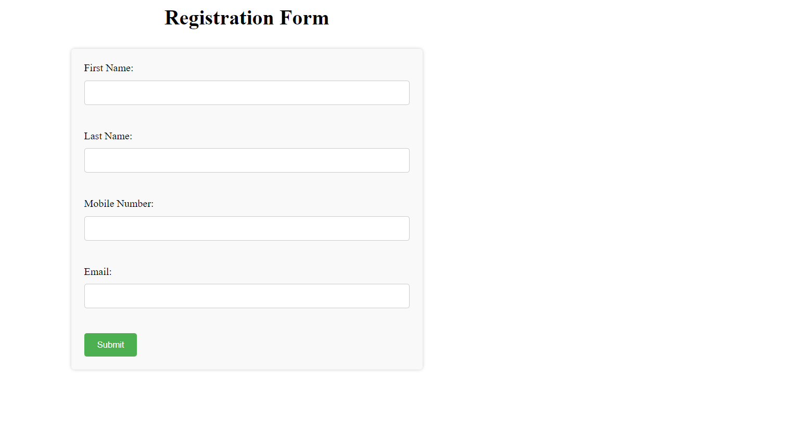
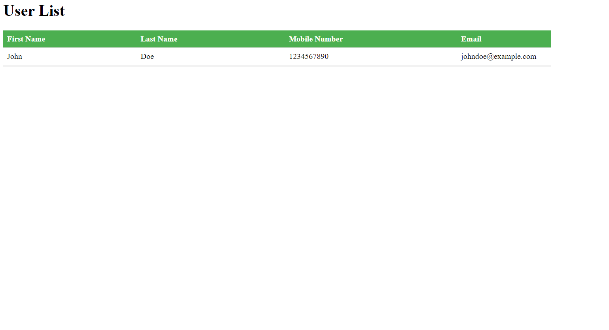

## This is the sample web app for creating users using html form and retreive all users from the databases

### pre-requisite 
Install the mysql-server
` apt install mariadb-server
  mysql_secure_installation `
  
## create myusers database
please refer to sql file in the repo

### Steps to run the app
` # git clone https://github.com/shahab-github/form.git `

### go inside
` cd form `

### install the dependencies
` pip install -r requirements.txt `

` export FLASK_APP=app.py `

### now run the app
` python app.py `
or
` flask run --host=0.0.0.0 `

### it will run on http://localhost:5000

#### home page

#### admin page

